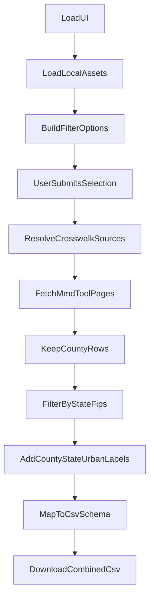

# MMD County CSV Downloader (Web)

Standalone vanilla JavaScript web app that downloads county-level MMD data from CMS and exports a combined CSV.

## Links

- **Live App (GitHub Pages):** [https://sstoops.github.io/mmd_web_downloader/](https://sstoops.github.io/mmd_web_downloader/)
- **Source Repository:** [https://github.com/sstoops/mmd_web_downloader](https://github.com/sstoops/mmd_web_downloader)

## Features

- Separate project/repo from the Python downloader.
- User-selectable filters:
  - State
  - Year
  - Measure (single or all available)
  - Adjustment
  - Condition/Service
- County-level only download (`geography=c`).
- Combined CSV export in tool-like columns.
- Bundled CMS metadata assets for browser CORS compatibility.

## How It Works

The app follows the same core data pattern as the CMS MMD tool, but runs as a static browser app:

1. Load local metadata assets from `assets/`:
   - `strings.json` (labels)
   - `menus.js` (condition and measure behavior)
   - `codebook_crosswalk.csv` (selection -> source mapping)
   - `countynames.tsv` and `urban.tsv` (county/state name enrichment)
2. Build dropdown options (state, year, measure, adjustment, condition/service).
3. On submit:
   - resolve one or more `_source` ids from crosswalk rows
   - call `https://data.cms.gov/data-api/v1/mmd-tool/` with pagination (`_size`, `_offset`)
   - request county rows only (`geography=c`)
   - filter to selected state by FIPS prefix
4. Convert rows to export columns and trigger browser CSV download.

## Data Flow



## CSV Output Schema

The export columns are:

- `population`
- `year`
- `geography`
- `measure`
- `adjustment`
- `analysis`
- `domain`
- `condition`
- `primary_sex`
- `primary_age`
- `primary_dual`
- `fips`
- `county`
- `state`
- `urban`
- `primary_race`
- `primary_eligibility`
- `primary_denominator`
- `analysis_value`

## Local Run

Serve this directory with any static server:

```bash
cd /app/tools/mmd-downloader-web
python3 -m http.server 8000
```

Then open:

- [http://localhost:8000](http://localhost:8000)

## GitHub Pages Deployment

Because this is a static app (no backend), it can be deployed directly to GitHub Pages:

1. Push this directory as its own repo.
2. In GitHub repo settings, enable Pages from the default branch root.
3. Confirm the published site URL.
4. For project repos, the URL is typically `https://<user>.github.io/<repo>/`.

## Refreshing CMS Metadata Assets

If CMS updates metadata files, refresh bundled assets:

```bash
cd /app/tools/mmd-downloader-web
npm run update-assets
```

## Notes

- The app depends on public CMS endpoints and assets.
- CMS static assets are bundled locally (`assets/`) because those files are not
  CORS-enabled for browser apps.
- Live county data still comes directly from the CORS-enabled
  `data-api/v1/mmd-tool` endpoint.
- If CMS changes schemas/assets, refresh local `assets/` copies and update
  parsers as needed.
- Output is county-only by design (state rows are excluded).
